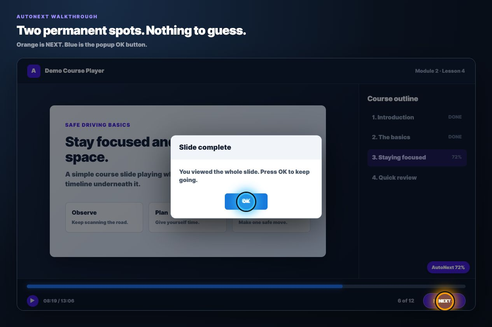
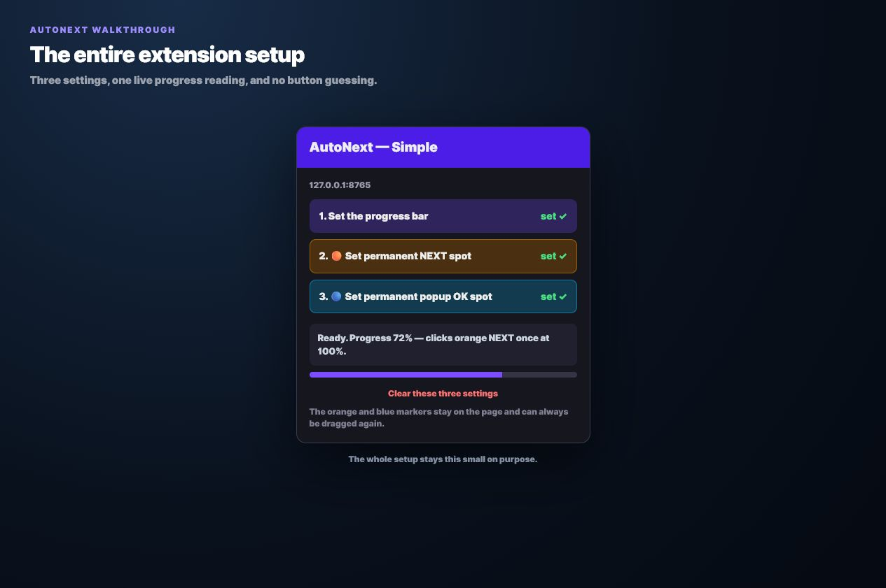
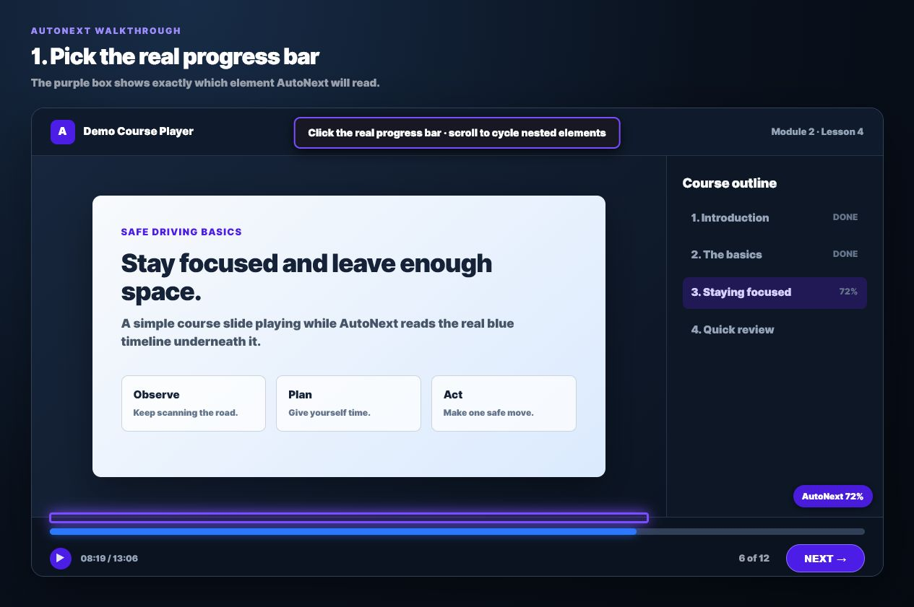
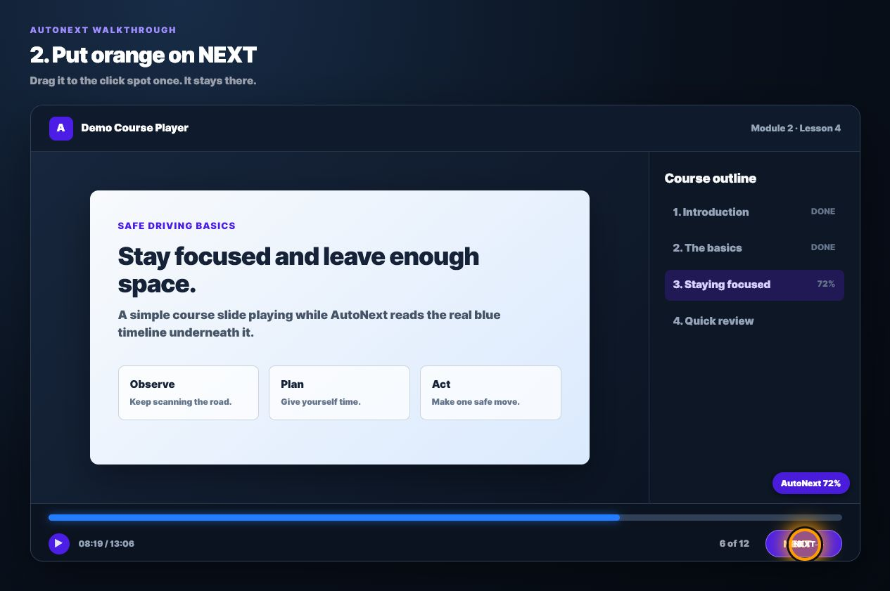
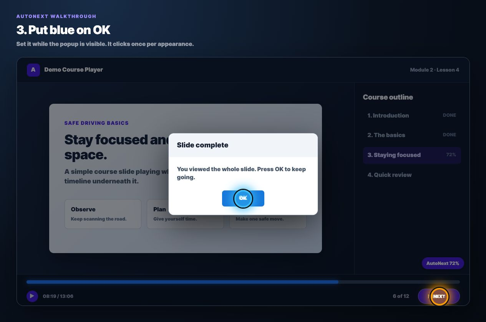

# AutoNext

I made AutoNext because I got tired of watching a course reach the end and then just sit there waiting for me to press **NEXT**. I did not want a huge extension trying to guess every button on every website. I only wanted it to watch the real progress bar and click the spots I picked.

So that is all this does: one progress bar, one orange NEXT spot, and one blue OK spot.

> The screenshots use a demo course player so none of my real course information is in the repo.

## The problem

Some course players finish a video or slide but do not move on. The NEXT button is already there, but I still have to keep checking the tab just to press it. Some players also put an OK popup in front of the page before NEXT can work.

My first versions tried to find and identify all those different buttons. That got complicated fast and it was less reliable than simply telling the extension exactly where I wanted it to click.

I rebuilt it around three things only:

1. Read the real progress bar.
2. Click the orange spot once when progress reaches 100%.
3. Click the blue spot once when the saved OK popup appears.

## How it works

### 1. Pick the real progress bar

Open AutoNext and press **Set the progress bar**. Move over the course's real progress bar and click it when the purple box is around the right element.

If the course has a bunch of elements stacked inside each other, use the scroll wheel while the picker is open to cycle through them. The little AutoNext badge shows the percentage it is currently reading.

AutoNext can read common progress formats such as an ARIA value, a normal HTML progress element, elapsed and total time, percentage text, or the visible fill width.

### 2. Put orange on NEXT

Press **Set permanent NEXT spot**. An orange marker appears. Drag it directly onto the NEXT button and leave it there.

The orange marker stays visible and draggable, so I can see the exact spot AutoNext will use. It does not try to decide which element looks like NEXT. When the selected progress bar changes to 100%, it clicks underneath the orange marker once. It will not keep clicking while the bar stays at 100%.

### 3. Put blue on OK

If the course has a completion popup, open that popup first. Then press **Set permanent popup OK spot** and drag the blue marker directly onto OK.

The blue marker also stays visible and draggable. AutoNext waits for that saved popup button to actually appear, clicks underneath the blue spot once, and waits for a new appearance before it can click again. If the course never shows an OK popup, this setting is optional.

That is the whole setup. After it is saved, I can close the extension panel. The markers and settings stay on the course page.

## Install it

1. Download or clone this repo.
2. Open `chrome://extensions` in Chrome.
3. Turn on **Developer mode**.
4. Press **Load unpacked**.
5. Select this project folder.

After changing any extension files, press **Reload** on the AutoNext extension card and reload the course page once.

## Quick setup

1. Set the progress bar.
2. Put the orange marker on NEXT.
3. Put the blue marker on OK if the course has that popup.
4. Let the course run.

## What it does not do

AutoNext does not answer quizzes, scrape course content, search for a NEXT button, or send data to a server. It only reads the progress element I selected and clicks the two positions I saved.

## Saved settings and privacy

The three settings are saved locally with Chrome extension storage and are kept separately for each website. There are no accounts, analytics, external APIs, or tracking in this extension.

## If something is not working

- **The percentage is wrong:** set the progress bar again and make sure the purple box is around the actual bar or fill element.
- **NEXT does not click:** drag the orange marker onto the middle of the real clickable NEXT button. Also make sure the AutoNext badge reaches 100%.
- **OK does not click:** open the popup first, set the blue spot again, and place it in the middle of OK.
- **The picker or markers do not appear:** reload the extension from `chrome://extensions`, then reload the course page once.
- **The page layout moved:** drag the orange or blue marker back onto its button. You do not have to clear everything.

If I want to start over, **Clear these three settings** removes the saved progress bar and both click spots for that website.

---

📧 [Email me](mailto:leafyfun100@gmail.com)
