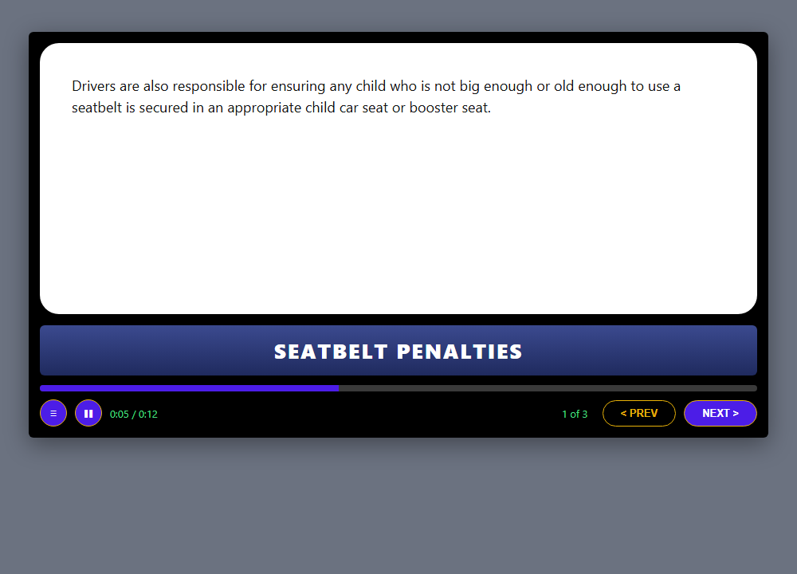
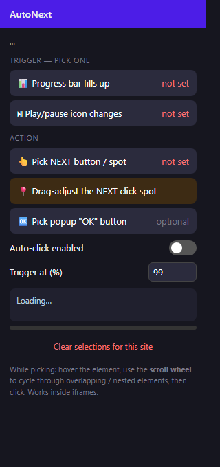

# AutoNext 🤖

A Chrome extension that clicks NEXT for you on those online course players that make you babysit every single video.

You know the ones — the video plays for 8 minutes, finishes, and then just... sits there waiting for you to click NEXT. Miss it and you've wasted 10 minutes staring at a frozen slide. This extension watches the player for you and clicks NEXT the moment it's done.

## The problem

The first version of this only worked with CSS selectors — you clicked on the progress bar and it saved a selector for it. Two problems with that:

1. **You couldn't actually select the right element.** These course players stack a million divs on top of each other, so when you clicked on the progress bar you'd actually grab some invisible overlay sitting on top of it. There was no way to get at the exact element you wanted.
2. **The NEXT button couldn't be mapped properly.** If the selector broke or pointed at the wrong thing, the click went nowhere — and you had no way to just say "click RIGHT HERE."

## The solution

Three things got rebuilt:

### 1. Scroll-wheel element picker
When you're picking an element, you now hover over it and **scroll the mouse wheel to cycle through every element stacked/nested under your cursor**. A little tooltip shows you exactly which element is highlighted (`div.progress-fill 420×8`) and how deep you are in the stack. No more grabbing the wrong invisible layer — you can drill down to the exact element.

### 2. Map the NEXT click anywhere
The NEXT target is now saved as an **exact spot on the page**, not just a selector. Pick it once, and if you ever need to fine-tune it, hit **"Drag-adjust the NEXT click spot"** in the popup — an orange marker appears that you can drag anywhere on the page. Wherever you drop it is where the click lands. The selector is kept too as a backup.

### 3. Watch the play/pause button instead (the smart way)
This was the best idea: when a video finishes, the **pause icon (⏸) flips back to play (▶)**. That flip is a way more reliable "video is done" signal than trying to measure a progress bar's pixels. So there's now a second trigger mode — pick the play/pause button, and the extension watches it for changes. When the icon flips after the video has been playing for a while, it clicks NEXT.

It doesn't matter what state the button is in when you pick it — the extension learns what the button looks like, waits until that look has held steady for ~5 seconds, and only fires when it *changes* after being stable. That way the flip right after clicking NEXT (new video starting) never re-triggers it.

### 4. Auto-dismiss blocking popups
Some players throw up a *"You have to view the entire slide to continue"* popup with an OK button that blocks everything. You can now map that OK button too (**🆗 Pick popup "OK" button** — do it while the popup is open). The extension checks every half second whether that button is actually visible **and on top** — if the popup shows up, OK gets clicked automatically. When the popup is closed, the hidden button is never touched, so there are no phantom clicks.

## Install

1. Open `chrome://extensions` in Chrome
2. Turn on **Developer mode** (top-right toggle)
3. Click **Load unpacked** and select this folder
4. Pin AutoNext to the toolbar (puzzle piece → pin)

## How to use

1. Open your course page and **reload it once** after installing
2. Click the AutoNext icon and pick **ONE trigger**:
   - **📊 Progress bar fills up** — click it, then hover the progress bar on the page. Scroll the wheel if the highlight isn't on the right element, then click. Fires when the bar hits the threshold (default 99%).
   - **⏯ Play/pause icon changes** — click it, then pick the play/pause button on the player. Fires when the icon changes after the video has been playing. This is the more reliable option for video players.
3. Pick the action: **👆 Pick NEXT button / spot** — click exactly where NEXT should be clicked
4. If the click spot ever needs moving: **📍 Drag-adjust the NEXT click spot** and drag the orange marker wherever you want
5. Optional: if the site shows a blocking *"view the entire slide"* popup, wait for it to appear once, then **🆗 Pick popup "OK" button** while it's open — from then on it gets dismissed automatically
6. Done. A little badge bottom-right shows what it's doing (`AutoNext ▶ 43%` or `AutoNext 👁 watching play/pause`). It goes green when it clicks.

Everything is saved **per site**, so you set it up once and it survives reloads and new slides. Works inside iframes too (course players basically always live in an iframe).

### Good to know

- **Play/pause mode:** if the video was already almost over when you set it up, you might have to click NEXT manually one time — after that it's fully automatic.
- **Bar mode** measures the bar several ways at once (aria values, `<progress>` elements, fill width, even time text like `5:31 / 8:37`), and a measurement only counts after it's first been seen *low* — so a full-width track can never cause a false click.
- There's a 4-second cooldown after every click so it can't spam NEXT.

## Testing it

Open `test-page.html` (or serve the folder and open it) — it's a mock course player where each slide "plays" for 12 seconds, complete with a pause button that flips to ▶ when the slide ends. Set up either trigger mode on it and watch it advance all 3 slides by itself. It even shows the blocking *"view the entire slide"* popup if NEXT is clicked too early, so you can test the OK-button mapping too.

## Privacy

No API keys, no servers, no tracking, no network requests at all. Your picked selectors are stored in `chrome.storage.local` on your own machine and never leave it.

## Troubleshooting

- **"Can't reach this page"** in the popup → reload the course page once after installing (and make sure it's not a `chrome://` tab)
- **Badge says "bar not found"** → the site re-rendered its player with different markup; clear selections and pick again
- **NEXT never fires in bar mode** → try the play/pause trigger instead, or lower the threshold to ~97%
